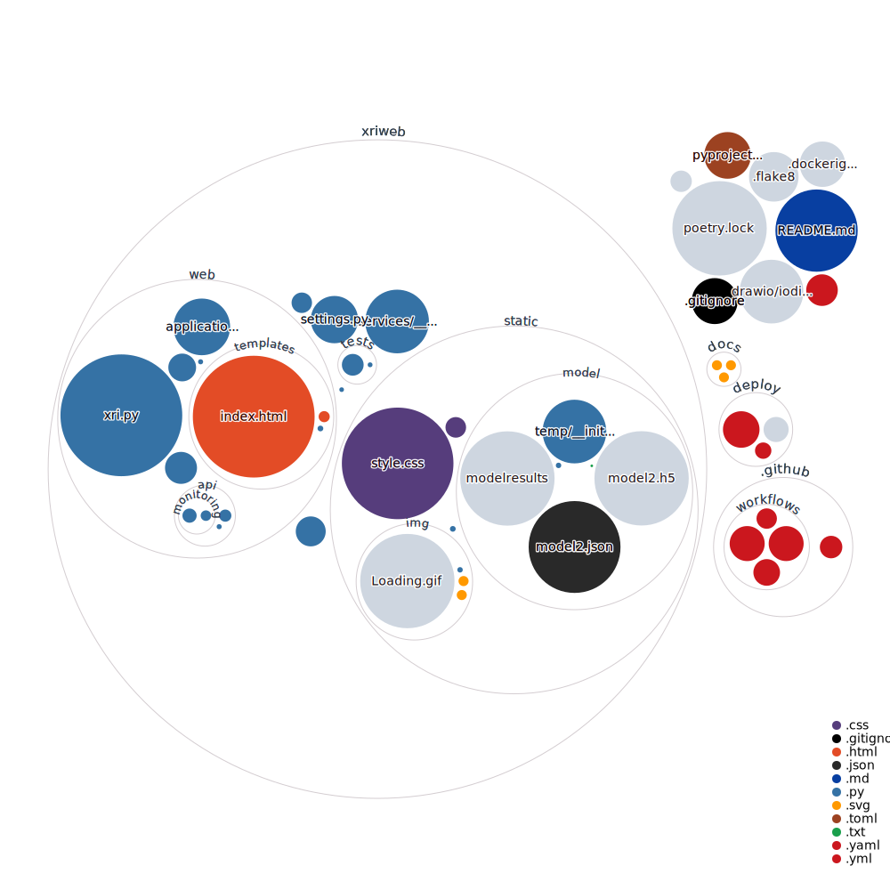

# xriweb

This is a web application that uses the xray image to predict if the patient has pneumonia or not.

This project was generated using fastapi_template.

The whole program is made with the help of github pilot.

## Requirements

* Python 3.10
* Poetry 1.1.11
* Docker 20.10.8
* Docker-compose 1.29.2

## Poetry

This project uses poetry. It's a modern dependency management
tool.

To run the project use this set of commands:

```bash
poetry install
poetry run python -m xriweb
```

This will start the server on the configured host.

You can find swagger documentation at `/api/docs`.

You can read more about poetry here: https://python-poetry.org/

## Docker

You can start the project with docker using this command:

```bash
docker-compose -f deploy/docker-compose.yml --project-directory . up --build
```

If you want to develop in docker with autoreload add `-f deploy/docker-compose.dev.yml` to your docker command.
Like this:

```bash
docker-compose -f deploy/docker-compose.yml -f deploy/docker-compose.dev.yml --project-directory . up --build
```

This command exposes the web application on port 8000, mounts current directory and enables autoreload.

But you have to rebuild image every time you modify `poetry.lock` or `pyproject.toml` with this command:

```bash
docker-compose -f deploy/docker-compose.yml --project-directory . build
```

## Project structure



```bash
$ tree "xriweb"
xriweb
├── __init__.py
├── __main__.py # Startup script. Starts uvicorn.
├── __pycache__
│   ├── __init__.cpython-310.pyc
│   ├── __init__.cpython-311.pyc
│   ├── __main__.cpython-310.pyc
│   ├── conftest.cpython-310-pytest-7.4.2.pyc
│   ├── conftest.cpython-311-pytest-7.4.2.pyc
│   ├── gunicorn_runner.cpython-310.pyc
│   └── settings.cpython-310.pyc
├── conftest.py # Fixtures for all tests.
├── services # Package for different external services such as rabbit or redis etc.
│   ├── __init__.py
│   └── __pycache__
│       └── __init__.cpython-310.pyc
├── settings.py # Main configuration settings for project.
├── static # Static content.
│   ├── __init__.py
│   ├── globals.css
│   ├── img
│   │   ├── Loading.gif
│   │   ├── __init__.py
│   │   ├── grafig.svg
│   │   └── wellcome.svg
│   ├── model
│   │   ├── __init__.py
│   │   ├── model2.h5
│   │   ├── model2.json
│   │   ├── modelresults
│   │   ├── temp
│   │   │   ├── __init__.py
│   │   │   ├── temp.png
│   │   │   └── tempMain.png
│   │   └── temp.txt
│   ├── modelresults
│   │   └── ikkepnomonia2.png
│   ├── style.css
│   └── uploads
│       ├── bakteriapneumonias.png
│       └── ikkepnomonia2.png
├── tests # Tests for project.
│   ├── __init__.py
│   ├── __pycache__
│   │   ├── __init__.cpython-310.pyc
│   │   ├── __init__.cpython-311.pyc
│   │   ├── test_xriweb.cpython-310-pytest-7.4.2.pyc
│   │   ├── test_xriweb.cpython-310.pyc
│   │   └── test_xriweb.cpython-311-pytest-7.4.2.pyc
│   └── test_xriweb.py
└── web # Package contains web server. Handlers, startup config.
    ├── __init__.py
    ├── __pycache__
    │   ├── __init__.cpython-310.pyc
    │   ├── __init__.cpython-311.pyc
    │   ├── application.cpython-310.pyc
    │   ├── application.cpython-311.pyc
    │   ├── lifetime.cpython-310.pyc
    │   ├── lifetime.cpython-311.pyc
    │   ├── reshaperun.cpython-310.pyc
    │   └── xri.cpython-310.pyc
    ├── api # Package with all handlers.
    │   ├── __init__.py
    │   ├── __pycache__
    │   │   ├── __init__.cpython-310.pyc
    │   │   ├── __init__.cpython-311.pyc
    │   │   ├── router.cpython-310.pyc
    │   │   └── router.cpython-311.pyc
    │   ├── monitoring
    │   │   ├── __init__.py
    │   │   ├── __pycache__
    │   │   │   ├── __init__.cpython-310.pyc
    │   │   │   ├── __init__.cpython-311.pyc
    │   │   │   ├── views.cpython-310.pyc
    │   │   │   └── views.cpython-311.pyc
    │   │   └── views.py
    │   └── router.py # Main router.
    ├── application.py # FastAPI application configuration.
    ├── lifetime.py # Contains actions to perform on startup and shutdown.
    ├── reshaperun.py
    ├── templates
    │   ├── __init__.py
    │   ├── index.html
    │   └── results.html
    └── xri.py # The program itself, that th web apl9cation is using to make predictions, and make the result image.
```
### Network Diagram


## Configuration

This application can be configured with environment variables.

You can create `.env` file in the root directory and place all
environment variables here.

All environment variables should start with "XRIWEB_" prefix.

For example if you see in your "xriweb/settings.py" a variable named like
`random_parameter`, you should provide the "XRIWEB_RANDOM_PARAMETER"
variable to configure the value. This behaviour can be changed by overriding `env_prefix` property
in `xriweb.settings.Settings.Config`.

An example of .env file:
```bash
XRIWEB_RELOAD="True"
XRIWEB_PORT="8000"
XRIWEB_ENVIRONMENT="dev"
```

You can read more about BaseSettings class here: https://pydantic-docs.helpmanual.io/usage/settings/

## Pre-commit

To install pre-commit simply run inside the shell:
```bash
pre-commit install
```

pre-commit is very useful to check your code before publishing it.
It's configured using .pre-commit-config.yaml file.

By default it runs:
* black (formats your code);
* mypy (validates types);
* isort (sorts imports in all files);
* flake8 (spots possible bugs);


You can read more about pre-commit here: https://pre-commit.com/


## Running tests

If you want to run it in docker, simply run:

```bash
docker-compose -f deploy/docker-compose.yml -f deploy/docker-compose.dev.yml --project-directory . run --build --rm api pytest -vv .
docker-compose -f deploy/docker-compose.yml -f deploy/docker-compose.dev.yml --project-directory . down
```

For running tests on your local machine.
1. you need to start a database.

I prefer doing it with docker:
```
docker run -p "5432:5432" -e "POSTGRES_PASSWORD=xriweb" -e "POSTGRES_USER=xriweb" -e "POSTGRES_DB=xriweb" postgres:13.8-bullseye
```


2. Run the pytest.
```bash
pytest -vv .
```
